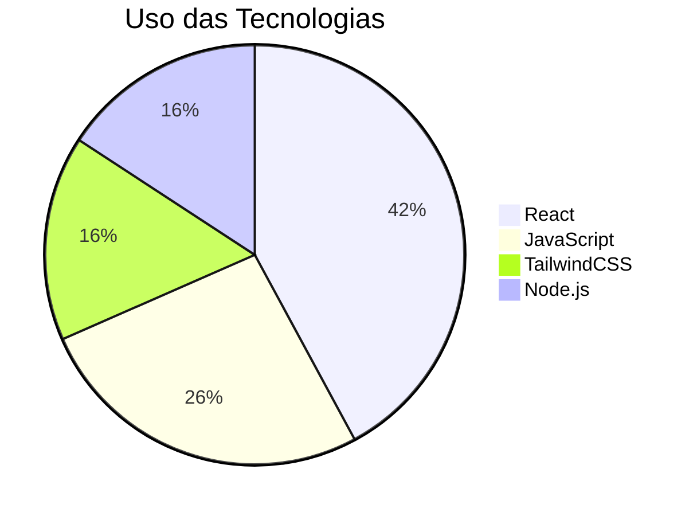
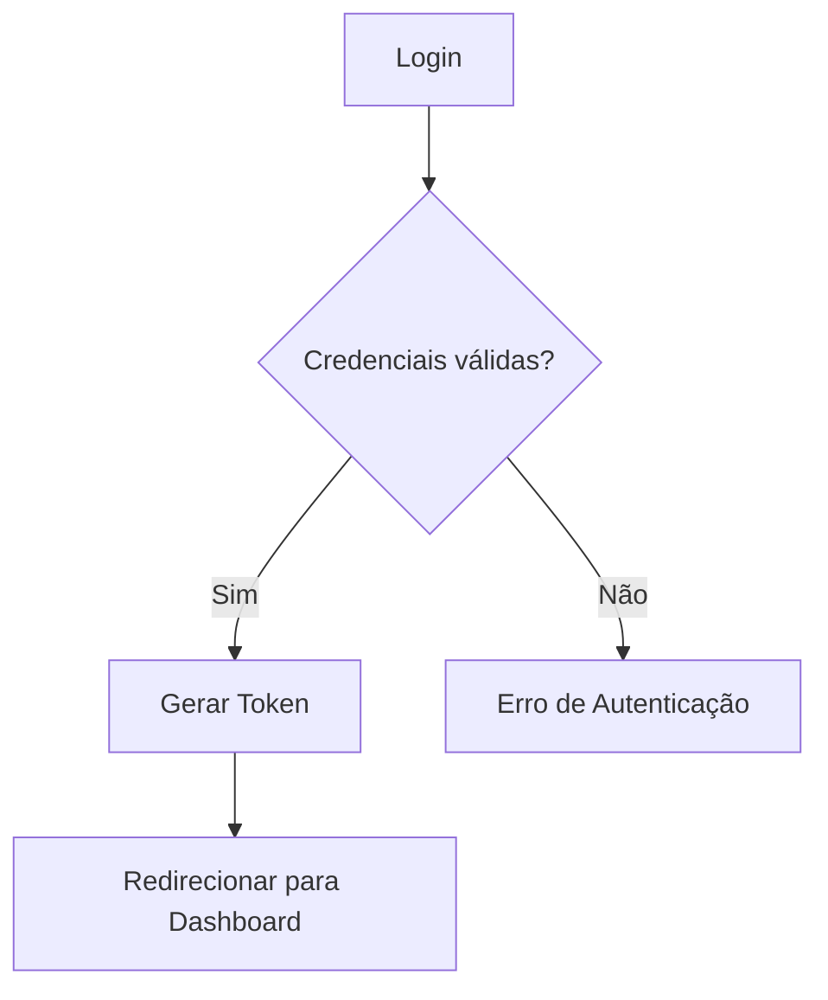
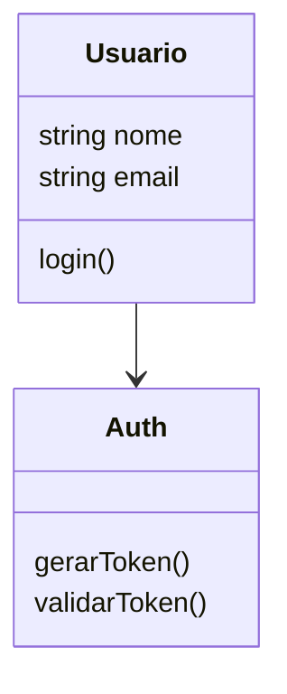
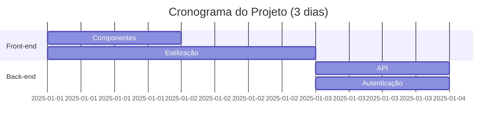

# **README PRINCIPAL (Organizado e Pronto para Uso)**

# **Devora - toki**

Aplicação web para gerenciamento de serviços

---

## **📡 Status do Projeto**

| Categoria          | Status                                                                  |
| ------------------ | ----------------------------------------------------------------------- |
| 🔧 Desenvolvimento |  |
| 🚀 Produção        |                  |
| 🧪 Testes          |            |

---

# **📊 Tecnologias Utilizadas**

## **Gráfico de Pizza – Proporção das Tecnologias**



# **📦 Arquitetura do Sistema**

Este bloco revela o fluxo operacional e o modelo interno — a “máquina invisível” operando por trás da interface.

## **🧭 Diagrama de Fluxo – Autenticação**



## **🧱 Diagrama de Classes – Estrutura Lógica**



# **🗓 Cronograma – Gantt**

O cronograma mostra o tempo como estrutura — o projeto é um processo, não um estado.



---

# **🛠 Stack Detalhada**

### **Front-end**

- ⚛️ React
- 🟨 JavaScript
- 🎨 TailwindCSS

### **Back-end**

- 🟩 Node.js
- 🚏 Express

---

# **👤 Responsável**

[@GuilhermeNantes](https://github.com/GuilhermeNantes)

---

# **🤝 Contribuindo**

Contribuições são sempre bem-vindas!

- Consulte [`CONTRIBUTING.md`](CONTRIBUTING.md)
- Siga [`CODE_OF_CONDUCT.md`](CODE_OF_CONDUCT.md)

---

# **🛠 Instalação**

```bash
git clone <url-do-repositorio>
cd nome-do-projeto
cd front-end
npm install
npm run dev
```

---

# **📸 Screenshots**


---

# **📄 Licença**

MIT
bé
Quer adicionar mais camadas ao README?
