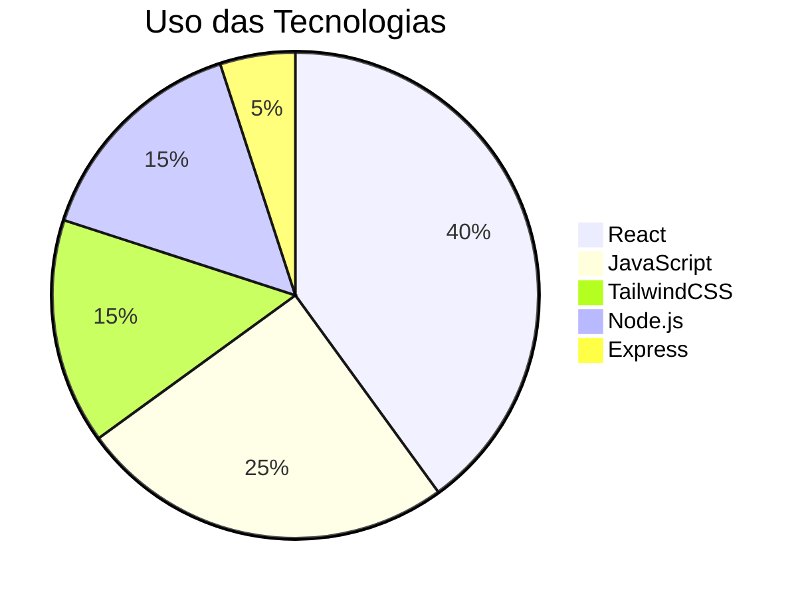
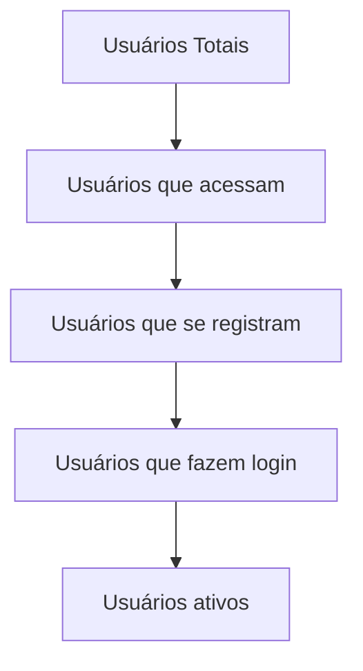
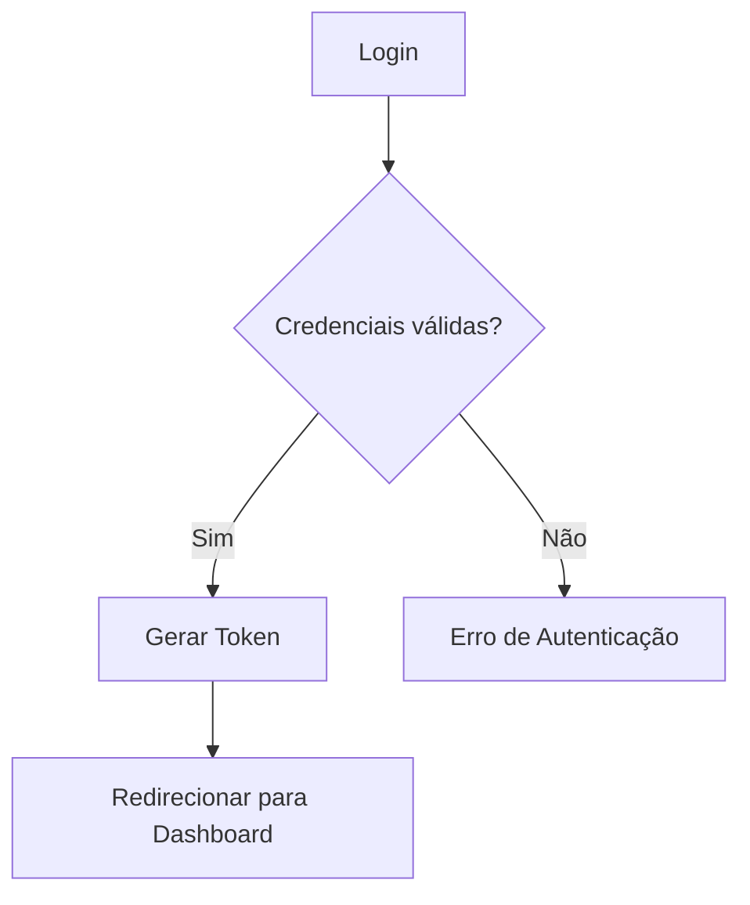
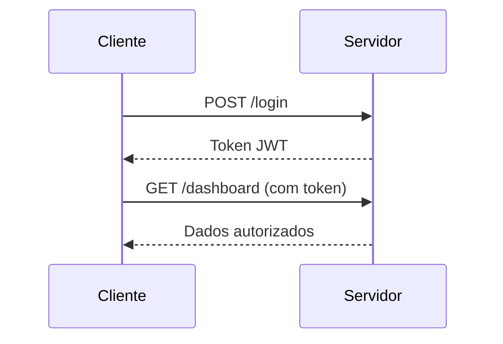
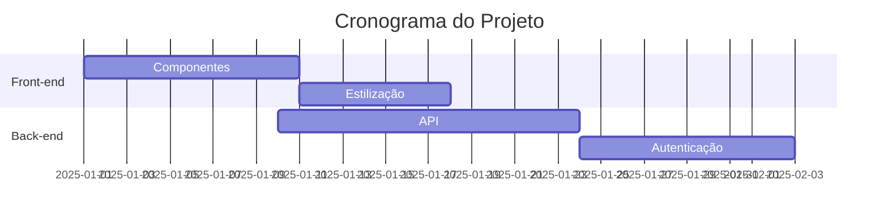
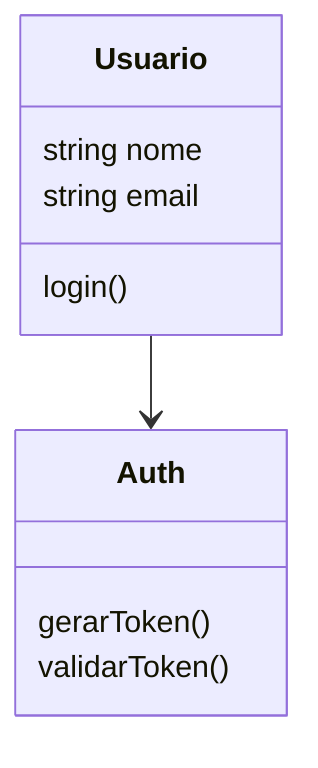
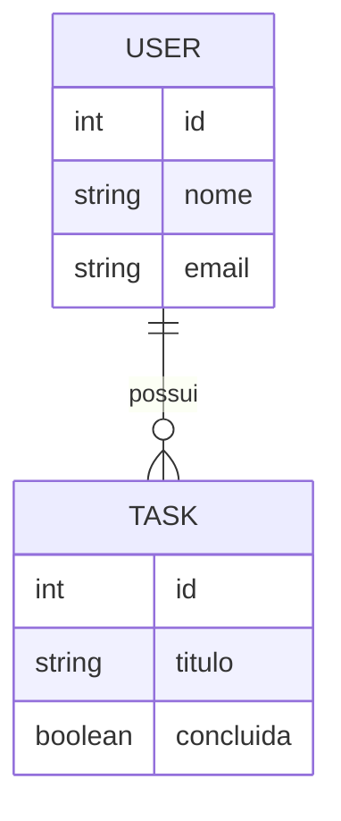

Aqui estão **vários tipos de gráficos** que você pode usar no **GitHub Markdown** usando **Mermaid** — todos funcionam direto no README.md e deixam a documentação muito mais bonita e profissional.

Abaixo listo:

* **Gráficos prontos com exemplos**
* **Quando usar cada tipo**
* **Códigos para copiar e colar**

---

# 📊 **1. Gráfico de Pizza (Pie Chart)**

Ótimo para mostrar proporções de tecnologias, módulos ou porcentagens.



---

# 📈 **2. Gráfico de Barras (Bar Chart)**

Bom para comparar valores (ex: desempenho, commits, módulos).

```mermaid
bar title Contribuições por Mês
    "Jan" : 10
    "Fev" : 22
    "Mar" : 13
    "Abr" : 18
```

---

# 📉 **3. Gráfico de Linha (Line Chart)**

Ótimo para mostrar evolução ao longo do tempo.

```mermaid
line
    title Crescimento do Projeto
    xaxis Jan Fev Mar Abr Mai Jun
    yaxis 0 10 20 30 40
    data "Commits" 2 6 14 22 35 48
```

---

# 🪜 **4. Gráfico de Funil (Funnel Chart)**

Bom para processos: login, autenticação, vendas, passos de funnels.



---

# 🧭 **5. Diagrama de Fluxo (Flowchart)**

Útil para explicar processos (login, cadastro, API, rotas etc.)



---

# 🔄 **6. Diagrama de Sequência (Sequence Diagram)**

Excelente para APIs, autenticação, rotas, comunicação entre serviços.



---

# 🗂 **7. Diagrama de Gantt (Cronograma)**

Perfeito para roadmap, planejamento e entregas.



---

# 🧱 **8. Diagrama de Classes (Class Diagram)**

Bom para modelagem de sistemas e APIs.



---

# 🗃 **9. Diagrama de Entidade-Relacionamento (ERD)**

Excelente para banco de dados.



---

# 🔍 **10. Gráfico de Radar (Radar Chart)**

Bom para comparar níveis (skills, módulos, performance).

```mermaid
radar
    title Comparação de Skills
    axes "React" "JavaScript" "Node" "CSS"
    data "Dev 1" 80 70 60 90
    data "Dev 2" 50 85 75 60
```

---

# ✔ Quer que eu adicione esses gráficos no seu README?

Posso montar:

* Um **dashboard** de gráficos
* Um README completo e estilizado
* Gráficos específicos para *tecnologias, tarefas, API, banco, progresso etc.*

É só me dizer **qual você quer usar no seu README principal**.
