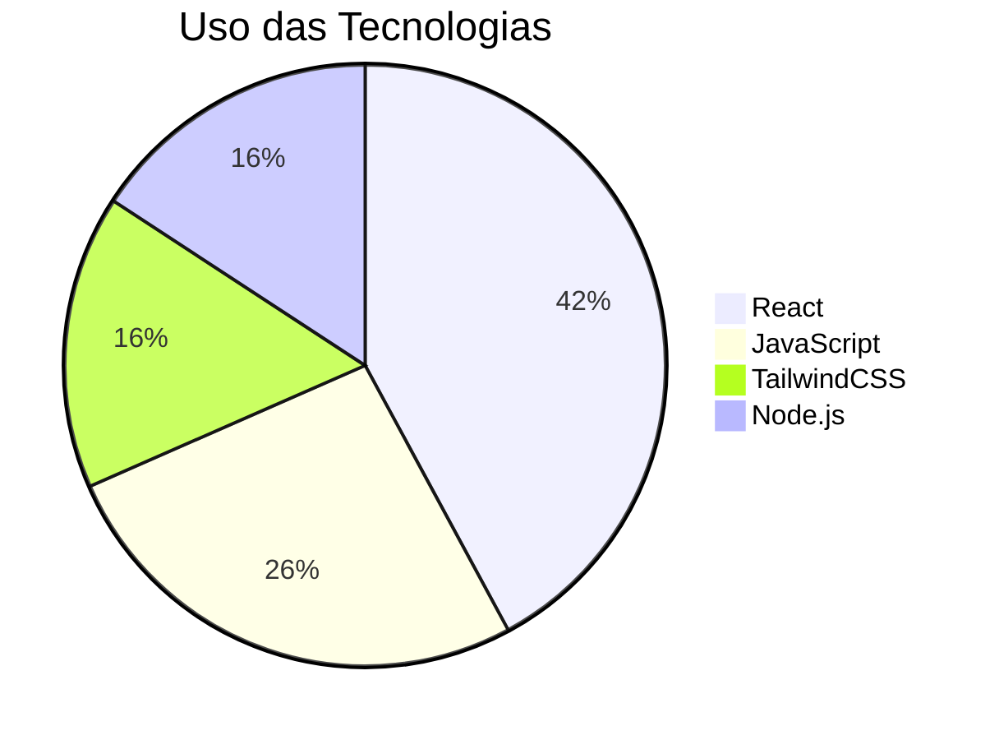

# **README PRINCIPAL (Organizado e Pronto para Uso)**

# **Devora - ServiceGate**

Aplicação web para gerenciamento e agendamento de serviços

---

# **📊 Tecnologias Utilizadas**

## **Gráfico de Pizza – Proporção das Tecnologias**



## **🧱 Diagrama Entidade-Relacionamento**


# **🛠 Stack Detalhada**

### **Front-end**

- ⚛️ React
- 🟨 JavaScript
- 🎨 TailwindCSS

### **Back-end**

- 🟩 Node.js
- 🧱 MySQL

---

# **👤 Responsáveis**

- [@GuilhermeNantes](https://github.com/GuilhermeNantes)
- [@MateusStortiHellmann](https://github.com/Mah-Shuu)
- [@ElielMurbach](https://github.com/ElielMurbach)
- [@RobertFernandes](https://github.com/kamurakk)
- [@EvandroMarques](https://github.com/evandroocm)

---

# **🤝 Contribuindo**

Contribuições são sempre bem-vindas!

- Consulte [`CONTRIBUTING.md`](CONTRIBUTING.md)
- Siga [`CODE_OF_CONDUCT.md`](CODE_OF_CONDUCT.md)

---

# **🛠 Como usar**

- Abrir Back-End
```bash
cd Back-end
npm install
npm start
```

- Abrir Front-End
```bash
cd Front-end
npm install
npm run dev
```

- Necessário ligar o XAMPP
- Criar banco de dados no phpMyAdmin
- Arquivo do banco: Debora-Hackathon/Back-end/sql/servicegate_schema.sql
- Após criar o banco, no terminal do Back-end dê o comando:
```bash
node seed.js
```
- Então o sistema vai estar pronto para uso

---

# **📸 Screenshots**


