# **README PRINCIPAL (Organizado e Pronto para Uso)**

# **Devora - ServiceGate**

Aplicação web para gerenciamento e agendamento de serviços

---

# **📊 Tecnologias Utilizadas**

## **Gráfico de Pizza – Proporção das Tecnologias**


## **🧭 Diagrama de Fluxo – Autenticação**

```mermaid
flowchart TD
    A[Login] --> B{Credenciais válidas?}
    B -->|Sim| C[Gerar Token]
    B -->|Não| D[Erro de Autenticação]
    C --> E[Redirecionar para Dashboard]
```



## **🧱 Diagrama de Classes – Estrutura Lógica**


# **🛠 Stack Detalhada**

### **Front-end**

- ⚛️ React
- 🟨 JavaScript
- 🎨 TailwindCSS

### **Back-end**

- 🟩 Node.js
- 🧱 MySQL

---

# **👤 Responsável**

[@GuilhermeNantes](https://github.com/GuilhermeNantes)
[@MateusStortiHellmann](https://github.com/Mah-Shuu)
[@ElielMurbach](https://github.com/ElielMurbach)
[@RobertFernandes](https://github.com/kamurakk)
[@EvandroMarques](https://github.com/evandroocm)

---

# **🤝 Contribuindo**

Contribuições são sempre bem-vindas!

- Consulte [`CONTRIBUTING.md`](CONTRIBUTING.md)
- Siga [`CODE_OF_CONDUCT.md`](CODE_OF_CONDUCT.md)

---

# **🛠 Instalação**

```bash
git clone <url-do-repositorio>
cd nome-do-projeto
cd front-end
npm install
npm run dev
```

---

# **📸 Screenshots**


